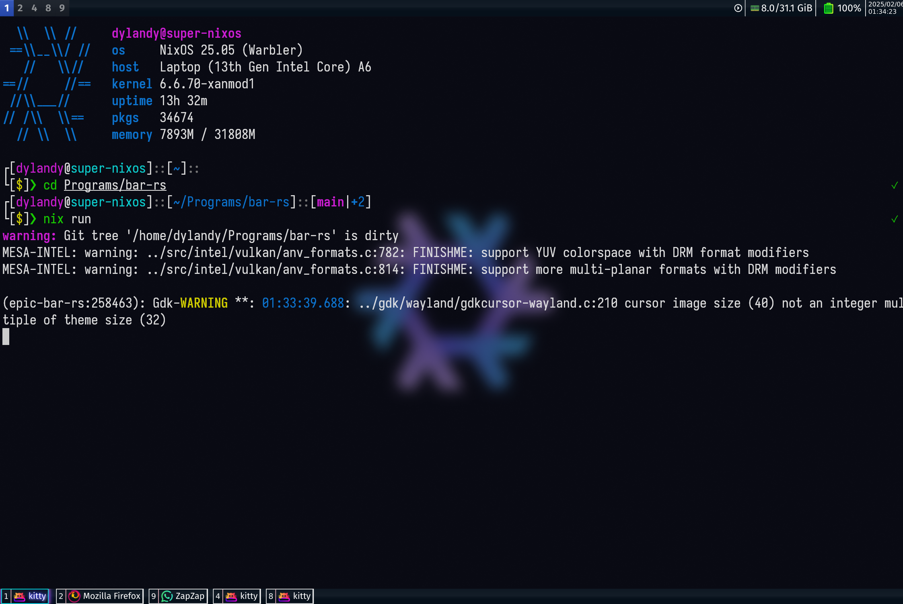

# epic bar

:warning: **This is in development(missing several modules)**: It doesnt look to bad now

This aims to reimplement a bar using [Eww widgets](https://github.com/elkowar/eww) that I made myself 
[here](https://github.com/DMGDy/eww-bar) as a standalone program using [GTK4](https://docs.gtk.org/gtk4/) 
and [gtk-layer-shell](https://github.com/wmww/gtk-layer-shell). 

This will only work on Hyprland as it primarily
communicates through Hyprland IPC sockets.

## why?

Most of the modules and behavior of what the bar should show has been implemented already through 
several compiled tools (although specifically for the the Eww widgets), so naturally I would like 
to implement all of it on its own. Here are the tools that generate Eww code to dynamically show widgets/
show system information:

* [workspaces](https://github.com/DMGDy/eww-workspaces)
* [statuses](https://github.com/DMGDy/statuses)
* [more statuses (in Rust)](https://github.com/DMGDy/statuses-rs)
* [Open windows in workspaces](https://github.com/DMGDy/eww-windows)

I previously relied on Rust crates to obtain information such as Netowrk and Wi-fi information but 
I will plan on simply using D-bus to interact with these services.

## TO-DO
Things to do in order of priority: 

1. [X] Have workspaces visible, differentiating active status
    1. [X] Clickable to switch to workspace
2. [ ] Show basic system information
    1. [X] Battery status
    2. [X] Calendar
    3. [ ] WiFi + WiFi Strength/SSID
    4. [ ] RAM 
    5. [ ] CPU (average core usage or highest core usage?)
    6. [ ] Volume (maybe most difficult)
3. [ ] Clickeable icon (Functionality TBD)
4. [X] Show open windows across different workspaces (Bottom bar or integrated in seperator of top bar)
    1. [X] With Icons
5. [ ] Easy to change colors and fonts with form of config (big maybe)
