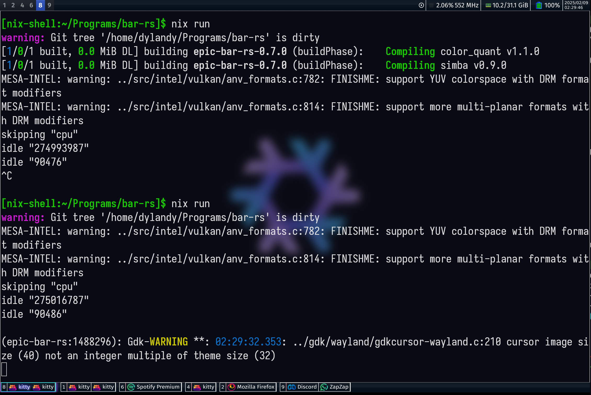

[](https://deps.rs/repo/github/DMGDy/epic-bar-rs)

# epic bar

:warning: **This is in development**: Currently the status bar I use every day




This aims to reimplement a bar using [Eww widgets](https://github.com/elkowar/eww) that I made myself 
[here](https://github.com/DMGDy/eww-bar) as a standalone program using [GTK4](https://docs.gtk.org/gtk4/) 
and [gtk-layer-shell](https://github.com/wmww/gtk-layer-shell). 

This will only work on Hyprland as it primarily
communicates through Hyprland IPC sockets.

Additionally this uses  and  for the images used in the bar (application icons,battery,RAM).

All content is licensed under GPL-3.

## Trying it out
If you are on NixOS or using Nix on your system and using Hyprland you can try it out without cloning the repository
by simply running the following if flake feature is enabled:
```
nix run github:DMGDy/epic-bar-rs
```
If flake is not enabled, clone repo and then:
```
nix-build
./result/bin/epic-bar-rs
```

### Modifying and Rebuilding
If you wanted to make changes to the source and rebuild with flake you can enter a development environment with:
(note: both will run the Cargo project build)
```
nix develop
```
or without flake:
```
nix-shell
```

## why?

Most of the modules and behavior of what the bar should show has been implemented already through 
several compiled tools (although specifically for the the Eww widgets), so naturally I would like 
to implement all of it on its own. Here are the tools that generate Eww code to dynamically show widgets/
show system information:

* [workspaces](https://github.com/DMGDy/eww-workspaces)
* [statuses](https://github.com/DMGDy/statuses)
* [more statuses (in Rust)](https://github.com/DMGDy/statuses-rs)
* [Open windows in workspaces](https://github.com/DMGDy/eww-windows)

I previously relied on Rust crates to obtain information such as Netowrk and Wi-fi information but 
~~I will plan on simply using D-bus to interact with these services.~~
Interacting with Netlink IPC socket to get network information would be much more direct
and fast.

## TO-DO
Things to do in order of priority: 

1. [X] Have workspaces visible, differentiating active status
    1. [X] Clickable to switch to workspace
2. [ ] Show basic system information
    1. [X] Battery status
    2. [X] Calendar
    3. [ ] WiFi + WiFi Strength/SSID
    4. [X] RAM 
    5. [X] CPU
        1. [X] Average load through `/stat/proc`
        2. [X] Frequency accross CPUs averaged from `/sys/devices/system/cpu/cpuX/cpufreq/scaling_cur_freq`
    6. [ ] Volume (maybe most difficult)
3. [ ] Clickeable icon (Functionality TBD)
4. [X] Show open windows across different workspaces (Bottom bar or integrated in seperator of top bar)
    1. [X] With Icons
5. [X] ~~Easy to change colors and fonts with form of config (big maybe)~~ css.rs 
6. [ ] Stop using `.unwrap()` and implement propper error handling (default values, fallback behavior/values)
